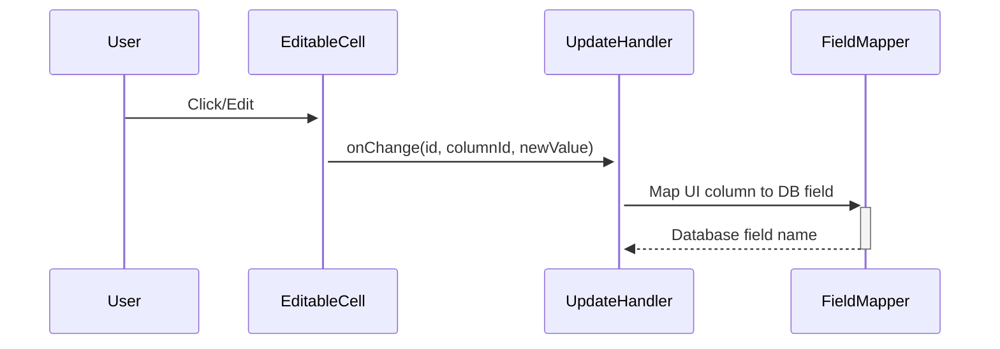

# Transaction Update Flow Documentation

This document details the transaction update system, including inline editing, API patterns, and error handling mechanisms.

## Overview

The transaction update flow has been redesigned to provide reliable, immediate updates with comprehensive error handling and cache management.

## Architecture Components

### Frontend Components

#### Inline Editing System

- **Editable cells**: Direct manipulation of transaction data in table cells
- **Field mapping**: Translation between UI column IDs and database fields
- **Type validation**: Client-side validation before server submission
- **Optimistic updates**: Immediate UI feedback with rollback on errors

#### Update Handler

```typescript
const updateTransactionData = async (id: number, columnId: string, newValue?: unknown) => {
  // Find transaction to update
  const transaction = transactions.find(t => t.id === id);
  
  // Map UI column to database field
  const fieldMap = {
    'payee': 'payeeId',
    'category': 'categoryId',
    'date': 'date',
    'amount': 'amount',
    'notes': 'notes',
    'status': 'status'
  };
  
  // Prepare update data with proper typing
  const updateData = prepareUpdateData(transaction, fieldMap[columnId], newValue);
  
  // Submit via API route
  await submitUpdate(updateData);
};
```

### Backend API Route

#### SvelteKit API Pattern

```typescript
// src/routes/accounts/[id]/api/update-transaction/+server.ts
export const POST: RequestHandler = async ({ request, params }) => {
  try {
    const data = await request.json();
    const caller = createCaller(await createContext());
    const result = await caller.transactionRoutes.save(data);
    
    // Comprehensive cache invalidation
    invalidateRelevantCaches(params.id);
    
    return json({ success: true, transaction: result });
  } catch (err) {
    return json({ success: false, error: err.message }, { status: 400 });
  }
};
```

#### tRPC Integration

```typescript
// Server-side tRPC caller bypasses client-side parsing issues
const caller = createCaller(await createContext());
const result = await caller.transactionRoutes.save(validatedData);
```

## Data Flow Sequence

### 1. User Interaction



### 2. Data Preparation

```typescript
// Type-safe data preparation
const prepareUpdateData = (transaction, field, newValue) => {
  const updateData = {
    id: transaction.id,
    accountId: Number(transaction.accountId),
    amount: Number(transaction.amount),
    date: transaction.date,
    notes: transaction.notes || null,
    payeeId: transaction.payee?.id ? Number(transaction.payee.id) : null,
    categoryId: transaction.category?.id ? Number(transaction.category.id) : null,
    status: transaction.status || "pending"
  };
  
  // Override with new value
  if (field === 'payeeId' || field === 'categoryId') {
    updateData[field] = newValue ? Number(newValue) : null;
  } else if (field === 'amount') {
    updateData[field] = Number(newValue);
  } else {
    updateData[field] = newValue;
  }
  
  return updateData;
};
```

### 3. API Submission

```typescript
const submitUpdate = async (updateData) => {
  const response = await fetch(`/accounts/${accountId}/api/update-transaction`, {
    method: 'POST',
    headers: { 'Content-Type': 'application/json' },
    body: JSON.stringify(updateData)
  });
  
  if (!response.ok) {
    throw new Error(`HTTP ${response.status}: ${response.statusText}`);
  }
  
  return response.json();
};
```

### 4. Cache Invalidation

```typescript
const invalidateRelevantCaches = (accountId) => {
  const numericAccountId = parseInt(accountId);
  
  // Clear account summary cache
  queryCache.delete(cacheKeys.accountSummary(numericAccountId));
  queryCache.delete(cacheKeys.allAccounts());
  
  // Clear transaction caches for all page combinations
  for (let page = 0; page < 10; page++) {
    for (const pageSize of [10, 25, 50, 100]) {
      queryCache.delete(cacheKeys.accountTransactions(numericAccountId, page, pageSize));
    }
  }
  
  // Clear recent transactions cache
  for (const limit of [5, 10, 15, 20]) {
    queryCache.delete(cacheKeys.recentTransactions(numericAccountId, limit));
  }
};
```

## Field Mapping System

### Column ID to Database Field Translation

The system uses a mapping layer to translate between frontend column identifiers and database field names:

```typescript
const fieldMap: Record<string, string> = {
  'payee': 'payeeId',        // UI shows payee name, DB stores payee ID
  'category': 'categoryId',   // UI shows category name, DB stores category ID
  'date': 'date',            // Direct mapping
  'amount': 'amount',        // Direct mapping with type conversion
  'notes': 'notes',          // Direct mapping
  'status': 'status'         // Direct mapping with enum validation
};
```

### Type Conversion Logic

```typescript
const applyTypeConversion = (field: string, value: unknown) => {
  switch (field) {
    case 'payeeId':
    case 'categoryId':
    case 'accountId':
      return value ? Number(value) : null;
    
    case 'amount':
      return Number(value);
    
    case 'date':
      return typeof value === 'string' ? value : value?.toString();
    
    case 'status':
      return value as 'cleared' | 'pending' | 'scheduled' | null;
    
    default:
      return value;
  }
};
```

## Error Handling

### HTTP 400 Resolution

The previous HTTP 400 errors were caused by tRPC client-side parsing issues. The solution uses SvelteKit API routes with server-side tRPC callers:

#### Problem

```typescript
// This caused parsing failures
const result = await trpc.transactionRoutes.save.mutate(data);
```

#### Solution

```typescript
// Server-side tRPC calling bypasses client parsing
const caller = createCaller(await createContext());
const result = await caller.transactionRoutes.save(data);
```

### Error Recovery Patterns

```typescript
const handleUpdateError = async (error: any, originalData: any) => {
  console.error('Update failed:', error);
  
  // Rollback optimistic updates
  await revertOptimisticChanges(originalData);
  
  // Show user-friendly error message
  showErrorToast(error.message || 'Failed to update transaction');
  
  // Refresh data to ensure consistency
  await refreshTransactionData();
};
```

## Cache Management Strategy

### Hierarchical Invalidation

The cache invalidation follows a hierarchical pattern to ensure data consistency:

```typescript
// Level 1: Account-specific caches
queryCache.delete(cacheKeys.accountSummary(accountId));

// Level 2: Cross-account caches
queryCache.delete(cacheKeys.allAccounts());

// Level 3: Paginated data caches
clearPaginatedCaches(accountId);

// Level 4: Client-side response cache
responseCache.clear();
```

### Cache Key Patterns

```typescript
const cacheKeys = {
  accountSummary: (id: number) => `account-summary:${id}`,
  allAccounts: () => 'all-accounts',
  accountTransactions: (id: number, page: number, pageSize: number) => 
    `account-transactions:${id}:${page}:${pageSize}`,
  recentTransactions: (id: number, limit: number) => 
    `recent-transactions:${id}:${limit}`,
  searchTransactions: (id: number, query: string) => 
    `search-transactions:${id}:${query}`
};
```

## Validation Layers

### Client-Side Validation

```typescript
const validateTransactionUpdate = (data: TransactionUpdateData): ValidationResult => {
  const errors: string[] = [];
  
  if (!data.accountId || isNaN(data.accountId)) {
    errors.push('Valid account ID required');
  }
  
  if (data.amount !== undefined && (isNaN(data.amount) || data.amount === 0)) {
    errors.push('Amount must be a non-zero number');
  }
  
  if (data.date && !isValidDate(data.date)) {
    errors.push('Invalid date format');
  }
  
  return { isValid: errors.length === 0, errors };
};
```

### Server-Side Validation

```typescript
// tRPC endpoint with Zod schema validation
export const transactionRoutes = t.router({
  save: rateLimitedProcedure
    .input(formInsertTransactionSchema) // Zod validation
    .mutation(async ({ input, ctx }) => {
      // Additional business logic validation
      if (!input.accountId) {
        throw new TRPCError({
          code: "BAD_REQUEST",
          message: "Account ID is required for transaction",
        });
      }
      
      // Verify account exists
      const accountExists = await verifyAccountExists(input.accountId);
      if (!accountExists) {
        throw new TRPCError({
          code: "NOT_FOUND",
          message: "Account not found",
        });
      }
      
      // Process update
      return updateTransaction(input);
    }),
});
```

## Performance Considerations

### Optimistic Updates

```typescript
const performOptimisticUpdate = (transactionId: number, updates: Partial<Transaction>) => {
  // Update local state immediately for responsive UI
  transactions = transactions.map(t => 
    t.id === transactionId ? { ...t, ...updates } : t
  );
  
  // Update summary if amount changed
  if (updates.amount !== undefined && summary) {
    const amountDiff = updates.amount - originalAmount;
    summary.balance += amountDiff;
  }
};
```

### Batch Updates

```typescript
const processBatchUpdates = async (updates: TransactionUpdate[]) => {
  const promises = updates.map(update => submitUpdate(update));
  const results = await Promise.allSettled(promises);
  
  // Handle partial failures
  const failed = results.filter(r => r.status === 'rejected');
  if (failed.length > 0) {
    await handleBatchUpdateFailures(failed);
  }
  
  // Invalidate caches once for all updates
  invalidateRelevantCaches(accountId);
};
```

## Testing Strategy

### Unit Tests

```typescript
describe('Transaction Update Flow', () => {
  test('field mapping converts UI columns to DB fields', () => {
    expect(mapFieldName('payee')).toBe('payeeId');
    expect(mapFieldName('category')).toBe('categoryId');
  });
  
  test('type conversion handles numeric fields', () => {
    expect(convertFieldValue('amount', '123.45')).toBe(123.45);
    expect(convertFieldValue('payeeId', '5')).toBe(5);
    expect(convertFieldValue('payeeId', null)).toBe(null);
  });
});
```

### Integration Tests

```typescript
describe('Transaction Update API', () => {
  test('successful update invalidates relevant caches', async () => {
    await updateTransaction(mockData);
    
    expect(queryCache.has(cacheKeys.accountSummary(1))).toBe(false);
    expect(queryCache.has(cacheKeys.allAccounts())).toBe(false);
  });
  
  test('failed update preserves cache state', async () => {
    const originalCacheSize = queryCache.size;
    
    await expect(updateInvalidTransaction(invalidData)).rejects.toThrow();
    expect(queryCache.size).toBe(originalCacheSize);
  });
});
```

## Troubleshooting Guide

### Common Issues

#### 1. Updates Don't Persist

**Symptoms**: Changes appear in UI but disappear on page reload
**Causes**: Cache invalidation not comprehensive enough
**Solution**: Verify all relevant cache keys are being cleared

#### 2. HTTP 400 Errors

**Symptoms**: Update requests fail with "Bad Request"
**Causes**: Data parsing issues or validation failures
**Solution**: Check field mapping and type conversion logic

#### 3. Optimistic Updates Stuck

**Symptoms**: UI shows updated data but server never receives changes
**Causes**: Network errors or API endpoint issues
**Solution**: Implement timeout and retry mechanisms

### Debug Tools

```typescript
// Enable detailed logging
const DEBUG_UPDATES = true;

const logUpdateFlow = (stage: string, data: any) => {
  if (DEBUG_UPDATES) {
    console.log(`[Update Flow] ${stage}:`, data);
  }
};

// Usage
logUpdateFlow('Field Mapping', { original: columnId, mapped: fieldName });
logUpdateFlow('Type Conversion', { field, originalValue, convertedValue });
logUpdateFlow('API Request', { url, method, body });
logUpdateFlow('Cache Invalidation', { clearedKeys });
```

## Best Practices

### 1. Always Use Field Mapping

- Never directly use UI column IDs as database fields
- Maintain the mapping table for all supported fields
- Add validation for unmapped columns

### 2. Implement Comprehensive Error Handling

- Handle network failures gracefully
- Provide meaningful error messages to users
- Implement retry mechanisms for transient failures

### 3. Maintain Cache Consistency

- Invalidate all related caches after updates
- Use hierarchical cache clearing patterns
- Monitor cache hit rates for performance optimization

### 4. Validate at Multiple Layers

- Client-side validation for immediate feedback
- Server-side validation for security and data integrity
- Database constraints as final validation layer

## Future Enhancements

### Planned Improvements

1. **Real-time synchronization**: WebSocket-based updates for multi-user scenarios
2. **Conflict resolution**: Handling concurrent edits from multiple users
3. **Audit logging**: Track all transaction modifications for compliance
4. **Bulk update optimization**: Efficient handling of multiple simultaneous updates

### Performance Targets

- **Update latency**: <200ms from click to UI update
- **Persistence guarantee**: <500ms from submission to server confirmation
- **Error recovery**: <1s from error detection to UI restoration
- **Cache efficiency**: >95% cache hit rate for repeated operations

## Conclusion

The transaction update flow provides a robust, performant system for inline editing with comprehensive error handling and cache management. The architectural patterns established here can be extended to other entity update operations throughout the application.
